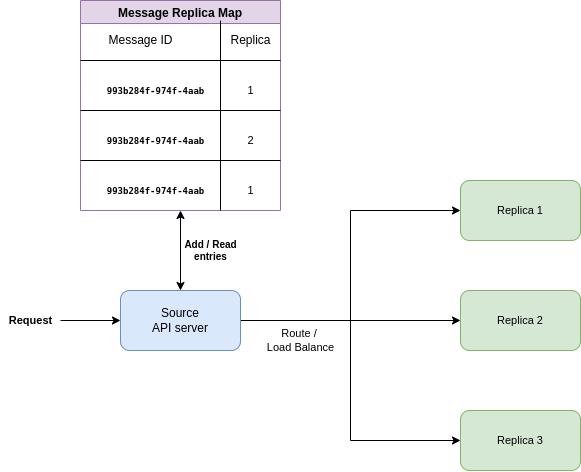
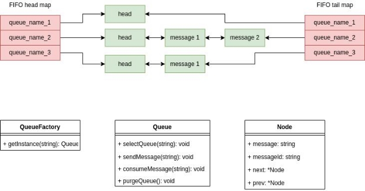

**JAMQ Messaging Queue**

**Engineering Design Document**

**Introduction**

JAMQ (Just Another Message Queue) is a message queue similar to Amazon Web Services’ [SQS](https://aws.amazon.com/sqs/) or [Beanstalkd. ](https://beanstalkd.github.io/)A message queue (MQ) is a queue to which one application (also known as producer) can push a message and another application (also known as consumer) can listen for any new messages and pick a message from the queue, process the message and delete the message. This process can be repeated as many times as required. These types of systems are known as event-driven systems and their key feature is asynchronous processing. Message queues can also be used for IPC (Inter-Process Communication). Message queues usually use AMQP (Advanced Message-Queueing Protocol) or MQTT for embedded devices. AWS SQS actually uses HTTP in its implementation (as per wikipedia). As mentioned in wikipedia, using a synchronous protocol for an asynchronous behavior is not unusual.

**Goals**

1. A simple and extensible message queue anyone can use and easily integrate.
1. Emphasis on scalability.
1. A decent amount of security and reliability (Nothing can be perfectly secure nor completely reliable).

**Technical Considerations**

- Use [HTTP](https://en.wikipedia.org/wiki/Hypertext_Transfer_Protocol) as the underlying protocol for easy integration by third party tools and there’s no necessity to write SDKs for each programming language because the user can just write a wrapper around the API calls. Another reason for this consideration is due to the fact that a minimal HTTP request just has an overhead of 16 bytes over raw [TCP](https://en.wikipedia.org/wiki/Transmission_Control_Protocol). Also writing semantics for TCP is an overkill considering HTTP already does that for us.
- Use Golang for the implementation because it’s a compiled language and it’s supposed to be faster than Java / Python.
- Dockerize the application so that it can be scaled and architectured in a cloud native way.

**Architecture**

JAMQ follows the source-replica architecture where a request goes to the source API server and the API server balances the load, and routes the traffic to the respective replica(s). A message replica map is maintained to know which replica is mapped to a message ID so that the operations can be directed towards that particular replica. There will also be a similar map maintained for the queue names that maps to replicas.

Figure 1

Figure 2

[Kubernetes](https://en.wikipedia.org/wiki/Kubernetes) can be used for the deployment. This is because kubernetes takes care of networking and container creation. Each replica will be defined as its own service and will be given its own top level domain. The only pitfall here is that kubernetes handles replication, autoscaling, load balancing and routing within itself and there’s no sure way to override this behavior. Therefore there is no way to add a custom load balancing within the replicas or autoscaled pods. There is no way to add custom subdomains or custom top level domains for each replica or autoscaled pods. However, there can be workarounds for these problems and they will be discussed under the “future scope” heading.

As far as the message replica map is concerned, this can be stored in memory with [redis](https://en.wikipedia.org/wiki/Redis) and can be treated as a separate pod altogether.

**Replica Low Level Design (LLD)**

Please note that the LLDs are written only in the perspective of service layers and not controllers. This doesn’t mean that the controller’s don’t exist. They do. But it’s more important to understand the service layer.

Here, there are two maps for each type of queue. They store a particular queue’s head address and tail address respectively. The head is required to consume the message and the tail is required to push the message. The data structure used for the queue will be a linked list because it is effective in freeing unused memory (Go has a garbage collector) and dynamically increasing the size of the queue.

The QueueFactory is a class that creates the right object depending on the type of queue that is going to be worked on. This follows the [factory method](https://en.wikipedia.org/wiki/Factory_method_pattern) design pattern. The Queue is an interface that has several overridable methods. Any type of queue that will be implemented will follow this interface. The selectQueue() method should store the head and tail node references. The sendMessage() method should push messages to the queue by creating additional nodes and linking them to the queue. The consumeMessage() method should read the message and delete the message from the queue. Finally, the purgeQueue() method should purge the entire queue and remove it from these maps.

The Node class depicts the queue node object which can contain a message, a randomly assigned UUID4, and pointers to the previous and next node.

**Source Low Level Design (LLD)**

The Monitor class deals with monitoring the status of replicas. The updateReplicaMessageCounts() will be called every time a message is pushed to the replicas. UpdateReplicaMap() is another method that updates the replicaMap and assigns new queues to replicas.

The router class provides three methods. The selectReplicas() method uses the queueName and queueType to pick the replicas from the queue replica map and stores this in the object. The route() method routes the message body to the selected replicas. The createNewQueue() method again uses the queueName and queueType to pick the lowest load replicas and assign the queue to those replicas.
